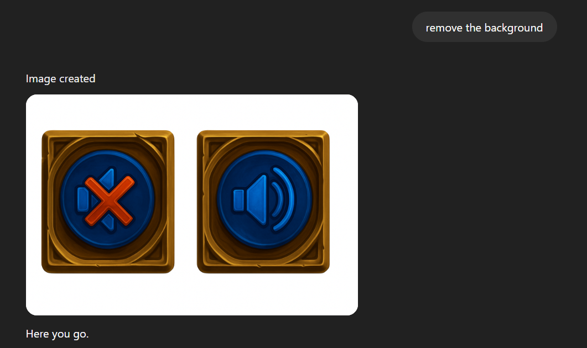

# Parakrama - The Card Battle Game

Welcome to **Parakrama Card Battle Game** – a dynamic card battle game featuring health bars, turn-based logic, and engaging gameplay!  
This project was built as part of the **CodeCircuit Vibe Coding Hackathon**.

---

## ✨ About the Game

This game is based in part on Indian Hindu Mythology and centers around two legendary characters: **Tara** and **Bhima**. The gameplay and card abilities are inspired by their mythological stories, bringing a unique cultural flavor to the card battle genre.

The game is also inspired by Blizzard Entertainment's **Hearthstone**, adapting its engaging mechanics and strategic depth to a new mythological setting.

---

## 🌐 Live Link

Check out the live version of the game here: [https://parakrama-card-game.vercel.app/](https://parakrama-card-game.vercel.app/)

---

## 🚀 What I Built

This is a prompt-based card battle game with:
- **Health bars** for each player
- **Turn-based logic** for strategic play
- Interactive UI and smooth gameplay

The game was developed based on the prompt:  
> *"Card battle game with health bars and turn logic"*,  
provided by the hackathon organizers.

---

## 🛠️ How to Run

1. **Clone the repository:**
   ```bash
   git clone https://github.com/rohit-dnath/parakrama-card-game.git
   cd parakrama-card-game
   ```

2. **Install dependencies:**
   ```bash
   npm install
   ```

3. **Start the development server:**
   ```bash
   npm start
   ```

4. **Open your browser and visit:**  
   [http://localhost:3000](http://localhost:3000)

---

## 📸 Screenshots

Below are some screenshots of the game in action:

<p align="center">
  
  
  
  
</p>

---

The images used in the game were created with OpenAI ChatGPT Image Creation Tool:

<div align="center" style="display: flex; flex-wrap: wrap; gap: 16px; justify-content: center;">
  
  
  
  
  
  
</div>

---

## 🏆 Built at CodeCircuit Vibe Coding Hackathon

This project was created during the **CodeCircuit Vibe Coding Hackathon**.  
Special thanks to the organizers for the exciting prompt and opportunity!

---

Enjoy the game and may the best strategist win!
